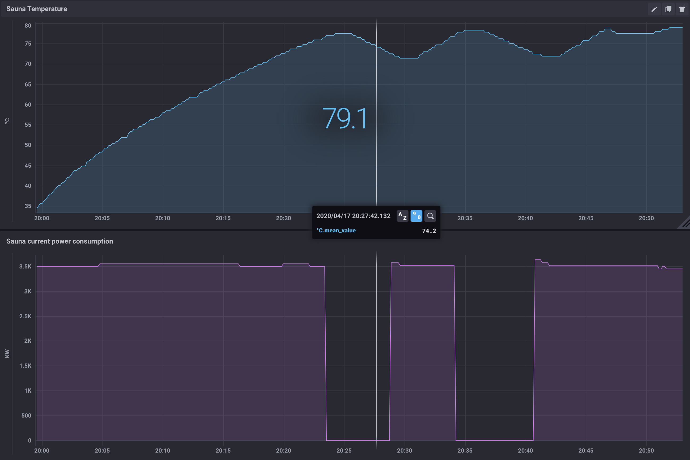

_This README and all other documentation and software in this repository are covered by the attached MIT license. Nothing in this repository should be construed as a recommendation or assertion that something is safe, legal or otherwise a good idea. Connecting a heater or any other electric device to a computer could do terrible things, like burn your house down. I’m not responsible for anything that happens if you choose to use this knowledge, so MAKE USE OF IT EXCLUSIVELY AT YOUR OWN RISK._

# An automated sauna – why?

Sauna's take a while to heat up. In my case, about 45 minutes for 85º Celsius. So, it is handy to be able to start it remotely – for example at the gym – so that the sauna is ready when I get home.

Unfortunately, most sauna's are not wired for this. They are pretty dumb, and while there are remote start modules for some sauna's, they are expensive and often require specific conrol units and heaters. If you didn't take this into account when you bought it, and paid quite a bit extra for it, you have no official options.

My sauna heater has no built-in thermostat. It has an on/off knob with a timer that turns the sauna on for 4 hours maximum, and then it switches off again.

The purpose of this project was to allow me to turn my sauna on remotely, or schedule it to be turned on. I also wanted thermostat functionality, allowing me to set my heater to a specific temperature rather than gradually getting hotter over time or having to manually turn it off and on all the time. Since I was busy anyway, I also added smart lights to my sauna that can change color and are easily dimmable. Finally, I wanted to be able to control all of this this via my phone but also with hardware buttons on the sauna itself. When you're chilled out after a sauna session, the last thing you want to do is have to find your phone to turn the sauna off – you want a physical button for that.

I am writing this up so other might make less mistakes than I did trying to get all of this to work. It is not meant as a finished solution, nor as a detailed step-by-step guide. Tweak it and make it your own.

# System components

It was my goal to create a system components that are as independent as possible, and to always be able to fall back to manual control of the sauna heater in case any of the smart components fail. The automation setup consists of the following components:

1. **A heavy-duty switch to turn the sauna on and off.** After two failed experiments with some lighter switches, this [Aeotec Heavy Duty Switch](https://aeotec.com/outdoor-z-wave-switch/) was a great find. It is rated for up to 40 amp which should be plenty for most home saunas. It uses the Z-Wave protocol.

2. **A temperature sensor.** Essential for thermostat functionality. I opted for a [Shelly 1PM](https://shelly.cloud/shelly-1pm-wifi-smart-relay-home-automation/) with the [temperature addon](https://shop.shelly.cloud/temperature-sensor-addon-for-shelly-1-1pm-wifi-smart-home-automation#312). This uses a DS18B20 sensor which is rated -55º to +125º, which should be plenty for even the most intense sauna sessions.

3. **Smart lights**. Since I have Philips Hue lights throughout my home it was simplest to get [these](https://www2.meethue.com/en-us/p/hue-white-and-color-ambiance-1-pack-gu10/046677542337). They are not officially rated for the kinds of temperatures a sauna sees, but there is cover between the lights and the sauna which takes some of the heat off them, and so far they have been working well (🤞).

4. **A physical button to control the sauna and lights.** I picked up a [Hue Dimmer Switch](https://www2.meethue.com/en-us/p/hue-dimmer-switch/046677473372) which has 4 buttons (on/off/dim/brighten). This is nice because I can link it to the Hue lights in the sauna very easily. I'll then monitor button presses in the conrol software to attach additional behavior to these presses that will turn the sauna on or off. They also look great and can easily be mounted on the outside of the sauna.

5. **Control software** to create the software thermostat, listen for hardware button presses, integrate with HomeKit, monitor energy usage and some other automation niceties. I use a Raspberry Pi with an [Aeotec Z-wave Stick](https://aeotec.com/z-wave-usb-stick/) and running [Home Assistant](https://www.home-assistant.io/).

# Switch, Temperature Sensor, Smart Lights & Buttons

Setting up the Aeotec Heavy Duty Switch is pretty straight forward, though make sure you get heat-proof electricity cable of the appropriate thickness (2.5mm wires in my case) for the capacity of your sauna heater.

One annoying aspect of the Aeotec switch is that its hardware on/off button is hidden behind a cover. Since I will not be using the switch outdoor anyway, I drilled a hole in this cover to expose the button. This allows me to always be able to turn the sauna on and off, even if all of the automation stuff breaks.

For the temperature sensor, I got a simple [waterproof junction box](https://www.google.com/search?q=junction+box+ip65&tbm=isch). Inside I split the incoming AC electricity to the Aeotec Heavy Duty Switch (connected to the sauna heater) and the Shelly 1PM with Temperature addon. I then added the power to the Hue lights to the Shelly switch. That last bit did not gain me much in automation options, but it did reduce the amount of wires in the junction box.

So I have AC coming into the junction box. Then a big fat AC wire coming out running to the Aeotech Heavy Duty Switch for the sauna, and two thinner (but also heat-proof) cables going out for the sauna lights and temperature sensor. These go into the sauna wall and out through the top, running over the roof of the sauna.

For the temperature sensor itself, I drilled a hole in the sauna wall where I wanted to place it, and another hole at the top of the sauna to run the wire through. I then embedded the sensor into a little block of wood and screwed that into the sauna wall.

To control both the lights and the sauna itself I set up the Hue Dimmer switch as you normally would to control lights. I then simply mounted it on the outside of the sauna. The control software will then monitor for button presses to attach additional behaviors to these buttons, like turning the sauna on or off. This ensures that even when my DIY automation magic breaks down, I can still turn on the lights.

# Control Software

With all of the hardware attached, we have the sauna behind a switch, a sensor that reports the temperature inside the sauna, and lights that can be controlled with a few buttons. The next step is to take all of these components and make them work in unison.

The easiest way to set up Home Assistant on the Pi is through [Hass.io](https://www.home-assistant.io/hassio/installation/) which provides ready to use images for all Pi models.

Once set up, take a look at the home_assistant folder in this repo for the config I use. Roughly I took these steps:

1. Enable the Z-Wave integration to add the Z-Stick and Aeotec Switch.
2. Install HACS to add unofficial integrations.
3. Through HACS, install the Shelly integration, to add the Shelly 1PM and temperature sensor.
4. Through HACS, install the Hue Remotes Advanced integration, to be able to listen for button presses on the Hue Dimmer Switch.
5. For ease of use, install the File Editor AddOn through the Supervisor. This will allow easy editing of the configuration files.
6. Enable the [Homekit integration](https://www.home-assistant.io/integrations/homekit) to control your sauna using Siri and the Home app. If you have an Apple TV or HomePod you can then also control your sauna when you are away from your home wifi network.

Then, to automate all of this, take a look at the two main config files:

**[configuration.yaml](home_assistant/configuration.yaml)** configures all of the integrations and sets up the software thermostat. I also use an *input_number* to store state: whether the sauna has reached the desired temperature yet. This state is then used to trigger a notification to my phone via the Home app and an audio announcement over a Sonos speaker (see Other Bits, below).

**[automations.yaml](home_assistant/automations.yaml)** configures all behavior. This file sets up listening for button presses on the Hue Dimmer Switch, turning the software thermostat on or off. It also manages the state variable I just mentioned, setting it when the sauna reaches the right temperature, and resetting it when appropriate.

# Conclusion

The described setup allows me to easily control my sauna using a few simple physical buttons, as well as control it remotely using the Home app or Siri. Besides automation, having a reliable thermostat is hugely helpful in making sure I don't slowly roast myself. Finally, knowing that if Home Assistant breaks, I can still control the sauna using a hardware button on the switch itself is a comforting thought.

# Other bits

Other completely superfluous stuff I did, just for kicks:
1. Add a little [script](home_assistant/scripts.yaml) that announces the current sauna temperature over Sonos, and add an [automation](home_assistant/automations.yaml) to do so when the sauna reaches the desired temperature.
2. Add the InfluxDB addon for Home Assistant for more powerful graphing abilities. This allows for easy inspection of the temperature slope to fine tune thermostat properties.

3. Add a fake smoke detector in Home Assistant that is triggered when the sauna reaches the desired temperature. This is neat because smoke detectors are the only sensors that can send push notifications with HomeKit. Check out the [config](home_assistant/configuration.yaml) on how this works.
   

# Inspiration

This project was heavily inspired by [William Henderson's SaunaKit](https://github.com/quicklywilliam/saunakit), from the use of the heavy duty switch, to using Home Assistant, to taking a smoke detector to get an alert when the sauna is ready. Thanks!